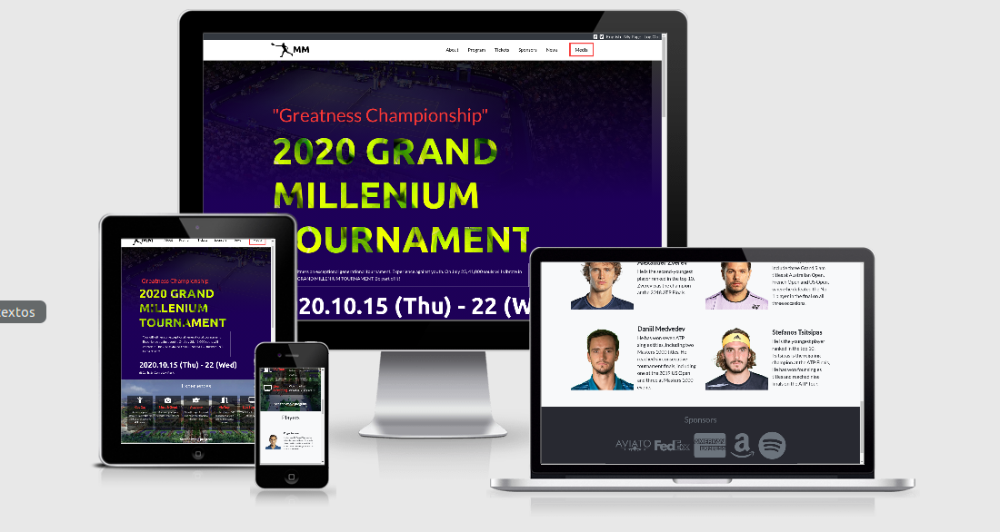
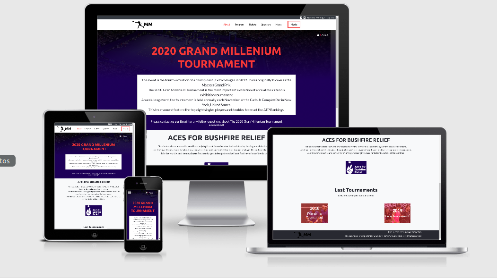
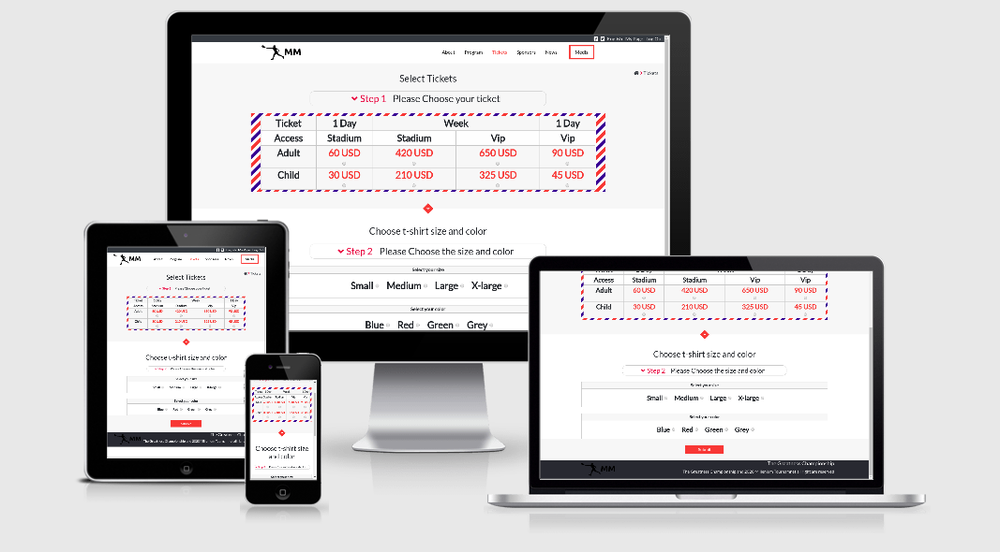

# About The Project

This is the HTML and CSS capstone project the objective is to create a website for an event using only the conceptual design to build the site taking care of the user experience and UI design.

Here is the link of the [Conceptual Design](https://www.behance.net/gallery/29845175/CC-Global-Summit-2015)

In my case, I decided to design my website for a fantasy Tennis Exhibition Tournament.

## Presentation Video

[Watch the video](https://youtu.be/ViLa-gzLxNY)

## Review Video 

[Watch the video](https://youtu.be/3-EfLdOKx98)

## The requirements of this pŕoject are:

### Design
- The main page, with a menu link to the about page and tickets page.
- The about page.
- The tickets page.

### Resolution
- Mobile: up to 768px.
- Desktop: from 768px.

### Guidelines design:

- Colors.
- Typographies: font face, size, and weight.
- Layout: composition and space between elements, for the 2 given screen sizes.

## Main Page

- The landing page has the basic information of the tournament, the activities for the visitors, the players and sponsors that are going to feature the tournament.

## About Page

- The about page has the basic have some historic information about the tournament, the information of a funding campaign, and a recap section of the previous years.

## Tickets Page

- The ticket page has the form to buy the access ticket and to choose the size and color of a free t-shirt of the event.

## I Built This Project With

- HTML.
- CSS.
- Flexbox.
- Bootstrap 4.

## GitHub Repo

- https://github.com/Salvador-ON/Html-Capstone

## Live Demo

- [Demo](https://salvador-on.github.io/Tennis-Tournament-Event)

## Author

👤 **Salvador Olvera Nava**

- Github: [@Salvador-ON](https://github.com/Salvador-ON)
- Twitter: [@Salvador_ON](https://twitter.com/Salvador_ON)
- Linkedin: [Salvador Olvera](https://www.linkedin.com/in/salvador-olvera-n)

## Show your support

Give a ⭐️ if you like this project!

## 📝 License

Distributed under the MIT License. See `LICENSE` for more information.
